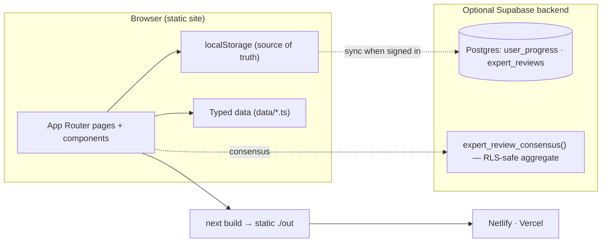

<div align="center">

# 🩺 CaseStep

### Digital Case-Based Learning to Enhance Clinical Reasoning in Community Medicine

*An International FAIMER Fellowship project · JSS Academy of Higher Education & Research, Mysuru*

[](https://github.com/sunilsclass-hub/casestep/actions/workflows/ci.yml)
[](https://nextjs.org/)
[](https://www.typescriptlang.org/)
[](https://tailwindcss.com/)
[](https://supabase.com/)
[](LICENSE)
[](CHANGELOG.md)

</div>

---

CaseStep delivers **digital, case-based learning** for MBBS students in Community Medicine. Instead of memorising facts, students work through authentic patient problems as **interactive, branching journeys** — generating hypotheses, weighing evidence, deciding under uncertainty, and connecting the individual patient to the health of the community. It combines branching cases, **Script Concordance Testing**, **OSCE/OSPE** assessment, reflection, and learning analytics in one platform, aligned with the **NMC Competency-Based Medical Education (CBME)** curriculum.

> **Principal Investigator:** Dr. D. Sunil Kumar — MBBS, MD (Community Medicine), PhD, MBA (Healthcare Management). Dean (Student's Welfare) · Professor of Community Medicine · International FAIMER Fellow, JSS AHER, Mysuru.

<div align="center">


</div>

## Table of contents

- [Highlights](#highlights)
- [Screenshots](#screenshots)
- [Case catalogue](#case-catalogue)
- [Educational frameworks](#educational-frameworks)
- [Technology stack](#technology-stack)
- [Architecture](#architecture)
- [Getting started](#getting-started)
- [Deployment](#deployment)
- [Optional Supabase backend](#optional-supabase-backend)
- [Project structure](#project-structure)
- [Roadmap](#roadmap)
- [Contributing](#contributing)
- [Citation](#citation)
- [License](#license)
- [Acknowledgements](#acknowledgements)

## Highlights

- 📚 **11 fully-authored interactive cases** across NCDs, maternal & child health, communicable disease, emergencies, and public-health scenarios.
- 🧠 **Script Concordance Test** — reasoning under uncertainty on a −2…+2 scale, scored against an expert panel.
- 🩺 **OSCE / OSPE stations** — weighted checklists, global rating scales, examiner notes, and printable rubrics.
- 📊 **Student & Faculty dashboards** — progress, SCT/OSCE scores, reflections, cohort analytics, and CSV export.
- 🔬 **Expert Review / Delphi module** with **live consensus** (median, IQR, % agreement, Round-2 flagging).
- ☁️ **Optional Supabase backend** — accounts + multi-device sync + persistent expert reviews; the app runs identically without it.
- ♿ **Accessible, responsive, academic UI**; ⚡ static export deploys anywhere with no server runtime.

## Screenshots

| Case library | Interactive case + branching decision |
| --- | --- |
|  |  |

| Script Concordance Test | OSCE / OSPE station |
| --- | --- |
|  |  |

| Student dashboard | Faculty dashboard |
| --- | --- |
|  |  |

| Expert Review / Delphi | Cloud sign-in (optional Supabase) |
| --- | --- |
|  |  |

## Case catalogue

All 11 topics are fully authored with the complete journey: **scenario → history → examination → investigations → branching decisions with feedback → clinical reasoning → community diagnosis → management → reflection → summary**.

| # | Case | Focus | Level |
| --- | --- | --- | --- |
| 1 | Type 2 Diabetes Mellitus | Threshold diagnosis; screening; complications | Intermediate |
| 2 | Hypertension | Correct measurement; staging; CVD risk | Intermediate |
| 3 | Antenatal Care | Risk stratification; danger signs; MCH package | Foundation |
| 4 | Postnatal Care | Mother + newborn danger signs; breastfeeding | Foundation |
| 5 | Acute Diarrhoea | IMNCI dehydration classification; ORS + zinc | Foundation |
| 6 | Upper Respiratory Tract Infection | Centor reasoning; antibiotic stewardship | Foundation |
| 7 | Urinary Tract Infection | Uncomplicated vs complicated; when to test | Intermediate |
| 8 | Chest Pain | Cannot-miss triage; time-critical ACS response | Advanced |
| 9 | Paediatric Growth & Nutrition | Growth trajectory; SAM criteria | Intermediate |
| 10 | Vector-borne Outbreak | Outbreak-investigation steps; vector control | Advanced |
| 11 | Environmental / Occupational Health | Exposure→disease reasoning; hierarchy of controls | Advanced |

## Educational frameworks

CaseStep is designed as a serious educational innovation, intentionally reflecting:

`NMC CBME curriculum` · `FAIMER project framework` · `Kern's 6-step model` · `ADDIE` · `TPACK` · `Clinical-reasoning theory` · `Script Concordance Testing` · `OSCE/OSPE competency assessment` · `Mixed-methods educational research` · `Implementation science`

See the **About** and **Research & Evaluation** pages in the app for how each is applied.

## Technology stack

| Layer | Technology | Notes |
| --- | --- | --- |
| Framework | **Next.js 14** (App Router) | Static export (`output: 'export'`) — no server runtime |
| Language | **TypeScript 5** | Typed data contracts (`lib/types.ts`) |
| Styling | **Tailwind CSS 3** | Custom academic design tokens |
| Icons | Custom inline SVG | No icon-library dependency |
| Persistence | **localStorage** (default) | Offline-first source of truth |
| Backend (optional) | **Supabase** (Postgres + Auth) | Accounts, sync, expert reviews, consensus RPC |
| Hosting | Netlify / Vercel / any static host | `netlify.toml`, `vercel.json` included |

## Architecture

CaseStep is **static-first** with an **optional** backend that layers on without changing the UI. Full details in **[docs/ARCHITECTURE.md](docs/ARCHITECTURE.md)**.



Key decisions: **static export** for deploy-anywhere simplicity; **localStorage as source of truth** so the app is fully functional offline and cloud sync is purely additive; an **env-gated Supabase client** so one codebase serves both the demo and the research deployment; and an **RLS + `SECURITY DEFINER`** design so the Delphi consensus is computable without exposing any individual expert's ratings.

## Getting started

Requires **Node.js 20+**.

```bash
# 1. Clone
git clone https://github.com/sunilsclass-hub/casestep.git
cd casestep

# 2. Install
npm install

# 3. Run the dev server (hot reload)
npm run dev                 # → http://localhost:3000

# 4. Production build → static site in ./out
npm run build

# 5. Preview the static build locally
npx serve out               # or: python3 -m http.server 8080 --directory out
```

## Deployment

The build is pure static files, so it hosts anywhere. Two zero-config paths:

### Vercel (recommended)

1. Push to GitHub → import the repo at [vercel.com](https://vercel.com).
2. Next.js is auto-detected; `vercel.json` pins the build. Click **Deploy**.

```bash
npm i -g vercel && vercel --prod
```

### Netlify

1. Import the repo at [netlify.com](https://netlify.com); it reads `netlify.toml`
   (build `npm run build`, publish `out`).

```bash
npm i -g netlify-cli && netlify deploy --build --prod
```

### GitHub Pages / any static host

Run `npm run build` and upload the contents of `out/`.

## Optional Supabase backend

By default, learner progress is stored in the browser. To enable **accounts** and **multi-device sync**:

1. Create a free project at [supabase.com](https://supabase.com).
2. **Project Settings → API** → copy the **Project URL** and **anon/public** key.
3. Copy `.env.example` → `.env.local` and fill both `NEXT_PUBLIC_SUPABASE_*` values.
4. In the Supabase **SQL editor**, run **[`supabase/schema.sql`](supabase/schema.sql)** (creates
   `user_progress` + `expert_reviews` tables with row-level security, and the
   `expert_review_consensus()` function that powers the live Delphi consensus).
5. Rebuild/redeploy. A **Sign in** control appears; signing in reconciles local and cloud progress
   (newest-wins) and keeps devices in sync. On Netlify/Vercel, set the same two `NEXT_PUBLIC_*`
   variables in the site's environment settings.

The anon key is a public, browser-safe value; data is protected by RLS. **Never** commit the
`service_role` key.

## Project structure

```
casestep/
├── app/                      # Next.js App Router pages
│   ├── layout.tsx  page.tsx  not-found.tsx  globals.css
│   ├── about/  cases/  cases/[slug]/  sct/  osce/
│   ├── dashboard/student/  dashboard/faculty/
│   └── expert-review/  research/  contact/
├── components/               # Reusable UI + interactive players
│   ├── Navbar  Footer  ui  icons  Providers  AuthWidget
│   ├── CaseCard  CasePlayer  SCTPlayer  SCTSection  OSCEStationCard
│   ├── StudentDashboard  FacultyDashboard  ExpertReview  ContactForm
├── data/                     # Local, typed mock data (JSON-like TS)
│   ├── cases.ts  cases-extra.ts   # 3 flagship + 8 additional full cases
│   └── sct.ts  osce.ts  cohort.ts  site.ts
├── lib/                      # Types, storage, and optional Supabase layer
│   ├── types.ts  storage.ts  useStore.ts
│   └── supabase.ts  auth.tsx  sync.ts  reviews.ts
├── supabase/schema.sql       # Tables, RLS, and consensus function
├── docs/                     # Architecture + screenshots
├── scripts/verify.mjs        # Headless-browser verification + screenshots
├── .env.example  netlify.toml  vercel.json  CITATION.cff
└── next.config.js  tailwind.config.ts  tsconfig.json
```

Data (`data/*`) is typed by `lib/types.ts` and carries `FUTURE DB INTEGRATION` markers, so a
database that returns the same shapes is a drop-in replacement.

## Continuous integration

Every pull request and every push to `main` is checked automatically by
**GitHub Actions** ([`.github/workflows/ci.yml`](.github/workflows/ci.yml)). The
**CI badge** at the top of this README reflects the status of the latest run on
`main` — green means lint, type-check, and the production build all pass.

The pipeline (Node.js 20, npm cache) runs:

| Step | Command | Gate |
| --- | --- | --- |
| Lint | `npm run lint` | ESLint (`next/core-web-vitals`) |
| Type-check | `npm run typecheck` | `tsc --noEmit` |
| Test | `npm test --if-present` | runs if a test script is added |
| Build | `npm run build` | Next.js static export |

**Verify locally before opening a PR** — run the same checks the CI does:

```bash
npm ci          # clean, lockfile-exact install
npm run lint       # ESLint
npm run typecheck  # TypeScript, no emit
npm run build      # production static export → ./out
```

If all four succeed locally, CI will pass.

## Roadmap

**v1.0 (this release)** — 11 interactive cases, SCT, OSCE/OSPE, dashboards, Expert Review with live
Delphi consensus, optional Supabase backend.

**Planned**
- [ ] Author SCT items and OSCE stations for all 11 case topics.
- [ ] Faculty analytics from real student data (normalised tables + faculty role/RLS).
- [ ] Expert-panel scoring keys for SCT from a completed Delphi round.
- [ ] Media: real clinical images/videos in place of placeholders.
- [ ] Localisation / multi-language support.
- [ ] Rich charting on dashboards (time-series, skills radar).
- [ ] Instructor authoring UI for cases (no code).
- [ ] Formal accessibility audit (WCAG 2.1 AA) and automated a11y tests in CI.
- [ ] Peer-reviewed publication of development, validation, and pilot outcomes.

## Contributing

Contributions from medical educators, clinicians, and developers are welcome — especially new
cases and clinical-content review. See **[CONTRIBUTING.md](CONTRIBUTING.md)** for setup, the
case-authoring guide, and coding conventions.

## Citation

If you use CaseStep in research, teaching, or presentations, please cite it (see
**[CITATION.cff](CITATION.cff)**):

> Kumar, D. Sunil. *CaseStep: Digital Case-Based Learning to Enhance Clinical Reasoning in Community
> Medicine* (Version 1.0.0) [Software]. 2026. JSS Academy of Higher Education & Research, Mysuru.
> https://github.com/sunilsclass-hub/casestep

## License

Released under the **[MIT License](LICENSE)**. Educational content is provided for undergraduate
medical education and research use; it is a teaching aid for clinical-reasoning practice, not a
clinical guideline or a substitute for authoritative national protocols.

## Acknowledgements

Developed within the **International FAIMER Fellowship**, with thanks to FAIMER mentors and
advisors, the Department of Community Medicine, and **JSS Academy of Higher Education & Research,
Mysuru**.

<div align="center">
<sub>© 2026 CaseStep · For educational and research use.</sub>
</div>
