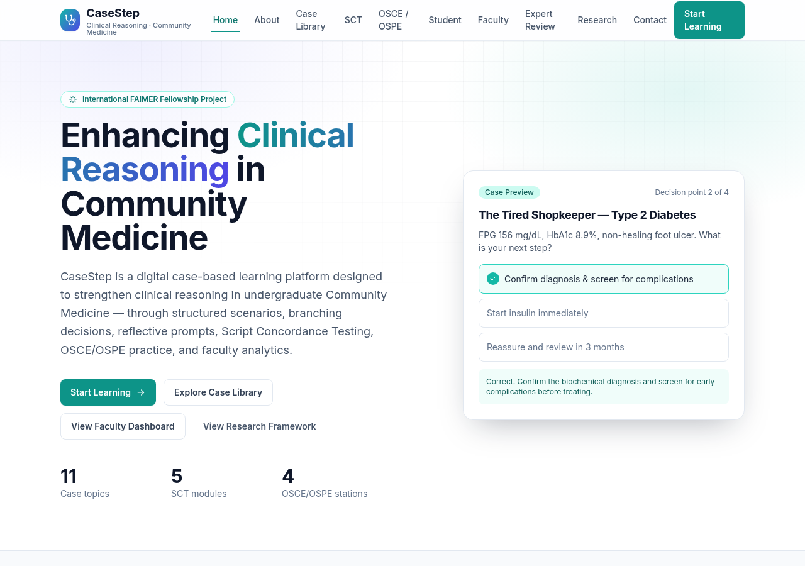
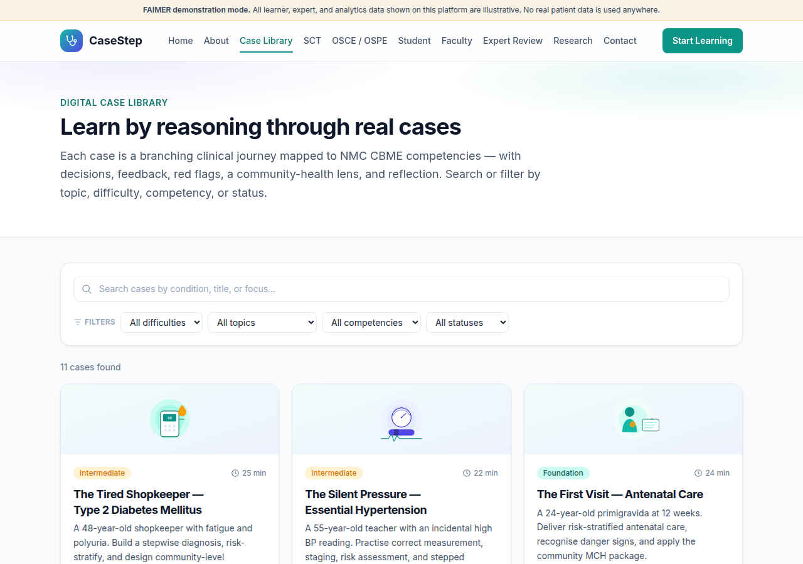
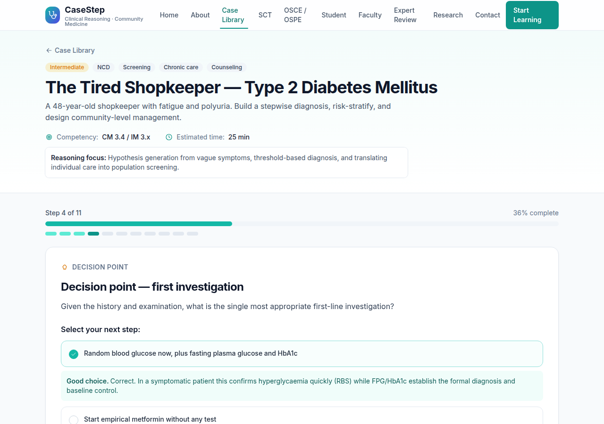
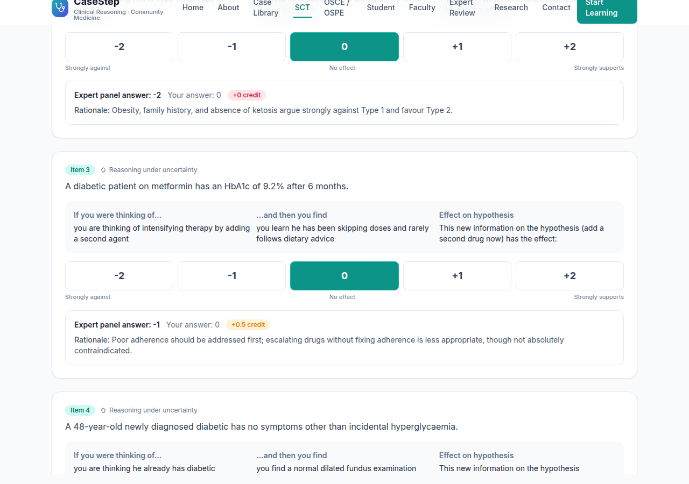
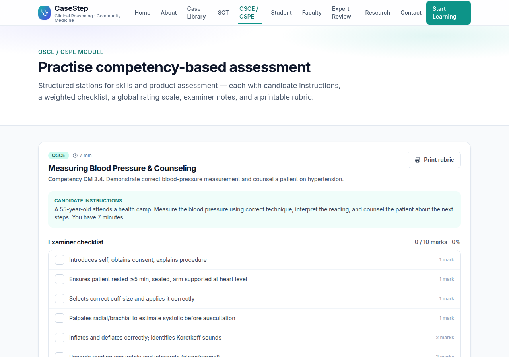
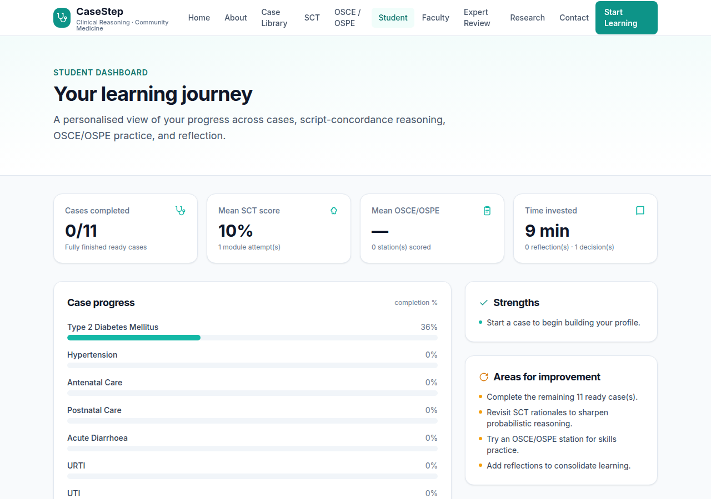
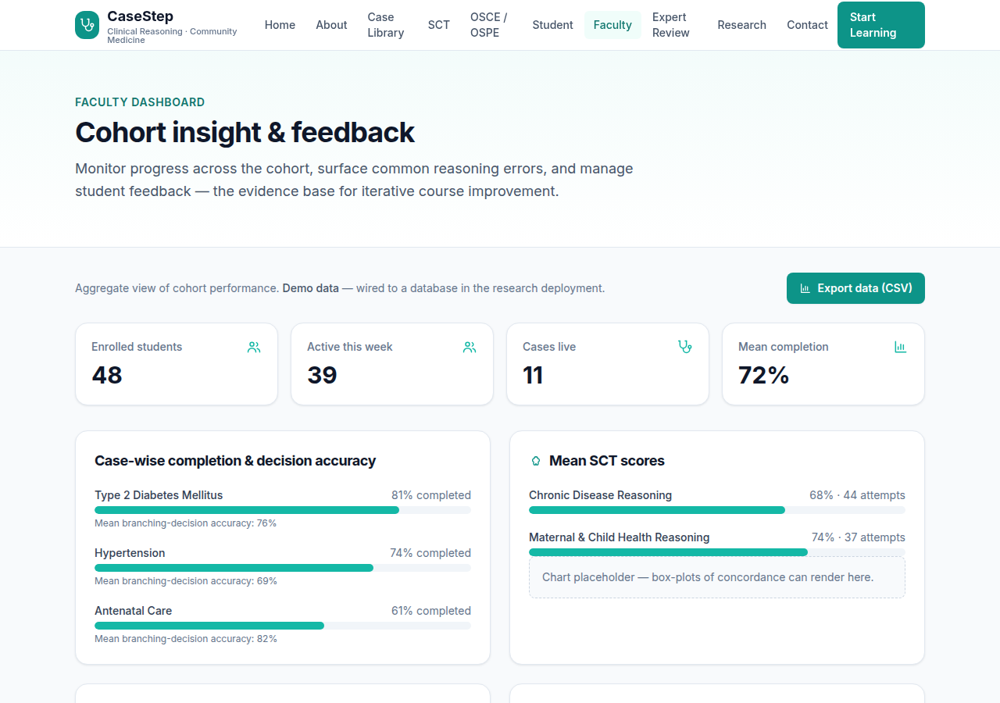
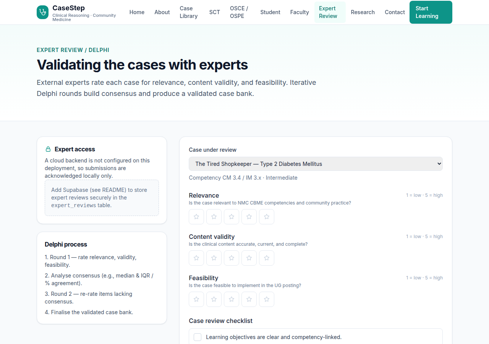
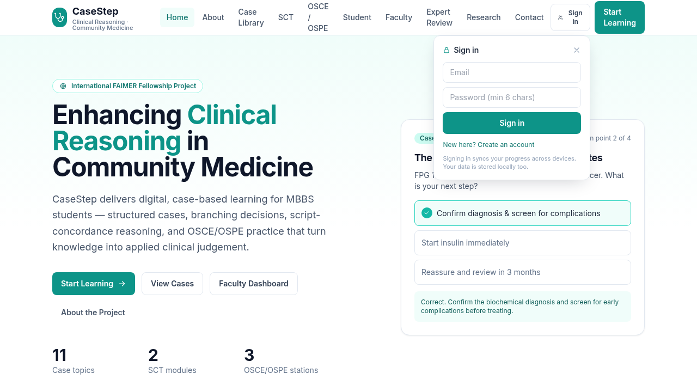
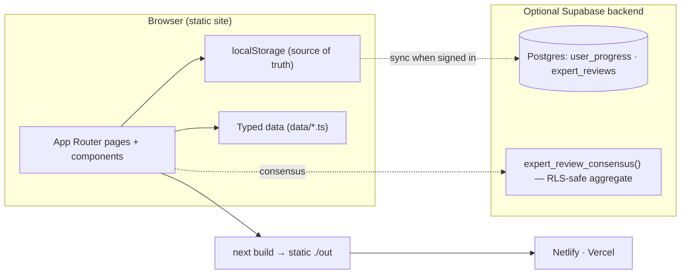

<div align="center">

# 🩺 CaseStep

### Digital Case-Based Learning to Enhance Clinical Reasoning in Community Medicine

*An International FAIMER Fellowship project · JSS Academy of Higher Education & Research, Mysuru*

[](https://github.com/sunilsclass-hub/casestep/actions/workflows/ci.yml)
[](https://nextjs.org/)
[](https://www.typescriptlang.org/)
[](https://tailwindcss.com/)
[](https://supabase.com/)
[](LICENSE)
[](CHANGELOG.md)

**🔗 Live site: [casestep.in](https://casestep.in/)**

</div>

---

CaseStep delivers **digital, case-based learning** for MBBS students in Community Medicine. Instead of memorising facts, students work through authentic patient problems as **interactive, branching journeys** — generating hypotheses, weighing evidence, deciding under uncertainty, and connecting the individual patient to the health of the community. It combines branching cases, **Script Concordance Testing**, **OSCE/OSPE** assessment, reflection, and learning analytics in one platform, aligned with the **NMC Competency-Based Medical Education (CBME)** curriculum.

> **Principal Investigator:** Dr. D. Sunil Kumar — MBBS, MD (Community Medicine), PhD, MBA (Healthcare Management). Dean (Student's Welfare) · Professor of Community Medicine · International FAIMER Fellow, JSS AHER, Mysuru.

### Demo mode, at a glance

The live site runs with **no backend required**: every page — including the Student Dashboard, Faculty Dashboard, and Expert Review — works fully offline in the browser using `localStorage`, with **clearly labelled illustrative/demo data** wherever real data would otherwise be expected (cohort analytics, expert consensus, sample learner progress). No real student records, real expert identities, real ethics-approval numbers, or real Delphi results are used anywhere. An **optional Supabase backend** (see [below](#optional-supabase-backend)) adds real accounts and cross-device sync when you're ready for an authenticated, ethics-approved deployment — the same UI serves both modes.

<div align="center">



</div>

## Table of contents

- [Highlights](#highlights)
- [Screenshots](#screenshots)
- [Case catalogue](#case-catalogue)
- [Educational frameworks](#educational-frameworks)
- [Media & academic integrity](#media--academic-integrity)
- [Technology stack](#technology-stack)
- [Architecture](#architecture)
- [Getting started](#getting-started)
- [Deployment](#deployment)
- [Optional Supabase backend](#optional-supabase-backend)
- [Project structure](#project-structure)
- [Roadmap](#roadmap)
- [Contributing](#contributing)
- [Citation](#citation)
- [License](#license)
- [Acknowledgements](#acknowledgements)

## Highlights

- 📚 **11 fully-authored interactive cases** across NCDs, maternal & child health, communicable disease, emergencies, and public-health scenarios.
- 🧠 **Script Concordance Test** — reasoning under uncertainty on a −2…+2 scale, scored against an expert panel.
- 🩺 **OSCE / OSPE stations** — weighted checklists, global rating scales, examiner notes, and printable rubrics.
- 📊 **Student & Faculty dashboards** — progress, SCT/OSCE scores, reflections, cohort analytics, actionable teaching recommendations, illustrative demo-data seeding, and CSV export.
- 🔬 **Expert Review / Delphi module** — **7 rating dimensions**, a review-quality checklist, and **live consensus** (median, IQR, % agreement, Round-2 flagging) computed **locally by default** (no backend required), with optional Supabase sync.
- ☁️ **Optional Supabase backend** — accounts + multi-device sync + persistent expert reviews; the app runs identically without it.
- 🔎 **Searchable, filterable Case Library** — filter by topic, difficulty, competency, or status.
- 🎨 **Premium academic design system** — a cohesive token set (indigo/teal/slate palette, refined shadows, subtle mesh gradients), shared components (`FeatureCard`, `ProgressRing`, `Stepper`, `EmptyState`, `DemoDataBanner`), and tasteful, reduced-motion-aware micro-interactions throughout.
- ♿ **Accessible, responsive, academic UI**; ⚡ static export deploys anywhere with no server runtime.
- 🖼️ **Original illustration system** — every case, OSCE station, and the homepage carries a hand-authored, abstract SVG illustration and, where relevant, a clearly-labelled video placeholder. See [Media & academic integrity](#media--academic-integrity) below.

## Screenshots

| Case library | Interactive case + branching decision |
| --- | --- |
|  |  |

| Script Concordance Test | OSCE / OSPE station |
| --- | --- |
|  |  |

| Student dashboard | Faculty dashboard |
| --- | --- |
|  |  |

| Expert Review / Delphi | Cloud sign-in (optional Supabase) |
| --- | --- |
|  |  |

## Case catalogue

All 11 topics are fully authored with the complete journey: **scenario → history → examination → investigations → branching decisions with feedback → clinical reasoning → community diagnosis → management → reflection → summary**.

| # | Case | Focus | Level |
| --- | --- | --- | --- |
| 1 | Type 2 Diabetes Mellitus | Threshold diagnosis; screening; complications | Intermediate |
| 2 | Hypertension | Correct measurement; staging; CVD risk | Intermediate |
| 3 | Antenatal Care | Risk stratification; danger signs; MCH package | Foundation |
| 4 | Postnatal Care | Mother + newborn danger signs; breastfeeding | Foundation |
| 5 | Acute Diarrhoea | IMNCI dehydration classification; ORS + zinc | Foundation |
| 6 | Upper Respiratory Tract Infection | Centor reasoning; antibiotic stewardship | Foundation |
| 7 | Urinary Tract Infection | Uncomplicated vs complicated; when to test | Intermediate |
| 8 | Chest Pain | Cannot-miss triage; time-critical ACS response | Advanced |
| 9 | Paediatric Growth & Nutrition | Growth trajectory; SAM criteria | Intermediate |
| 10 | Vector-borne Outbreak | Outbreak-investigation steps; vector control | Advanced |
| 11 | Environmental / Occupational Health | Exposure→disease reasoning; hierarchy of controls | Advanced |

## Educational frameworks

CaseStep is designed as a serious educational innovation, intentionally reflecting:

`NMC CBME curriculum` · `FAIMER project framework` · `Kern's 6-step model` · `ADDIE` · `TPACK` · `Clinical-reasoning theory` · `Script Concordance Testing` · `OSCE/OSPE competency assessment` · `Mixed-methods educational research` · `Implementation science`

See the **About** and **Research & Evaluation** pages in the app for how each is applied.

## Media & academic integrity

CaseStep uses **no stock photography, no real patient imagery, and no third-party or copyrighted
media anywhere on the platform.** Every visual is one of two things:

1. **Original illustrations** — small, hand-authored, flat-design SVGs (`public/media/**`), one per
   case topic and OSCE station. They are deliberately abstract/iconographic so they can never be
   mistaken for a real clinical photograph, and they carry zero licensing risk and near-zero
   network weight.
2. **Video placeholders** — a labelled card (title, learning objective, planned duration,
   transcript/captions "to be added") describing a planned institution-approved demonstration
   video. **No video file is embedded anywhere in this repository or deployment.** Real footage can
   only be added after institutional review and consent processes are complete.

Every page — SCT, both dashboards, Research & Evaluation, About, and Contact & Team — shares this
same illustration/disclaimer visual language, not just the Case Library and OSCE stations from the
initial multimedia pass.

**Current version:** v1.4.1 (see [CHANGELOG.md](CHANGELOG.md)).

## Technology stack

| Layer | Technology | Notes |
| --- | --- | --- |
| Framework | **Next.js 14** (App Router) | Static export (`output: 'export'`) — no server runtime |
| Language | **TypeScript 5** | Typed data contracts (`lib/types.ts`) |
| Styling | **Tailwind CSS 3** | Custom academic design tokens |
| Icons | Custom inline SVG | No icon-library dependency |
| Persistence | **localStorage** (default) | Offline-first source of truth |
| Backend (optional) | **Supabase** (Postgres + Auth) | Accounts, sync, expert reviews, consensus RPC |
| Hosting | Netlify / Vercel / any static host | `netlify.toml` included; Vercel auto-detects Next.js |

## Architecture

CaseStep is **static-first** with an **optional** backend that layers on without changing the UI. Full details in **[docs/ARCHITECTURE.md](docs/ARCHITECTURE.md)**.



Key decisions: **static export** for deploy-anywhere simplicity; **localStorage as source of truth** so the app is fully functional offline and cloud sync is purely additive; an **env-gated Supabase client** so one codebase serves both the demo and the research deployment; and an **RLS + `SECURITY DEFINER`** design so the Delphi consensus is computable without exposing any individual expert's ratings.

## Getting started

Requires **Node.js 20+**.

```bash
# 1. Clone
git clone https://github.com/sunilsclass-hub/casestep.git
cd casestep

# 2. Install
npm install

# 3. Run the dev server (hot reload)
npm run dev                 # → http://localhost:3000

# 4. Production build → static site in ./out
npm run build

# 5. Preview the static build locally
npx serve out               # or: python3 -m http.server 8080 --directory out
```

## Deployment

The build is pure static files, so it hosts anywhere. Two zero-config paths:

### Vercel (recommended)

1. Push to GitHub → import the repo at [vercel.com](https://vercel.com).
2. Next.js is auto-detected. Leave **Framework = Next.js** and **Output Directory = default**
   (do **not** override it to `out` — Next.js `output: 'export'` is served automatically). Click **Deploy**.

```bash
npm i -g vercel && vercel --prod
```

### Netlify

1. Import the repo at [netlify.com](https://netlify.com); it reads `netlify.toml`
   (build `npm run build`, publish `out`).

```bash
npm i -g netlify-cli && netlify deploy --build --prod
```

### GitHub Pages / any static host

Run `npm run build` and upload the contents of `out/`.

## Optional Supabase backend

By default, learner progress is stored in the browser. To enable **accounts** and **multi-device sync**:

1. Create a free project at [supabase.com](https://supabase.com).
2. **Project Settings → API** → copy the **Project URL** and **anon/public** key.
3. Copy `.env.example` → `.env.local` and fill both `NEXT_PUBLIC_SUPABASE_*` values.
4. In the Supabase **SQL editor**, run **[`supabase/schema.sql`](supabase/schema.sql)** (creates
   `user_progress` + `expert_reviews` tables with row-level security, and the
   `expert_review_consensus()` function that powers the live Delphi consensus).
5. Rebuild/redeploy. A **Sign in** control appears; signing in reconciles local and cloud progress
   (newest-wins) and keeps devices in sync. On Netlify/Vercel, set the same two `NEXT_PUBLIC_*`
   variables in the site's environment settings.
6. **For "Forgot password?" to work**, add your deployed origin's `/reset-password/` path (e.g.
   `https://casestep.in/reset-password/`) to **Authentication → URL Configuration → Redirect URLs**
   in the Supabase dashboard. Without this, Supabase rejects the redirect and the emailed reset
   link will not return the user to the app correctly.

The anon key is a public, browser-safe value; data is protected by RLS. **Never** commit the
`service_role` key. Password-reset emails share Supabase's built-in sender's rate limit (a few per
hour on the free tier without custom SMTP) — acceptable for infrequent, individual reset requests,
but not for bulk/simultaneous sign-ins (see the Known limitations section).

## Project structure

```
casestep/
├── app/                      # Next.js App Router pages
│   ├── layout.tsx  page.tsx  not-found.tsx  globals.css
│   ├── about/  cases/  cases/[slug]/  sct/  osce/
│   ├── dashboard/student/  dashboard/faculty/  reset-password/
│   └── expert-review/  research/  contact/
├── components/               # Reusable UI + interactive players
│   ├── Navbar  Footer  ui  icons  Providers  AuthWidget
│   ├── CaseCard  CasePlayer  SCTPlayer  SCTSection  OSCEStationCard
│   ├── StudentDashboard  FacultyDashboard  ExpertReview  ContactForm
├── data/                     # Local, typed mock data (JSON-like TS)
│   ├── cases.ts  cases-extra.ts   # 3 flagship + 8 additional full cases
│   └── sct.ts  osce.ts  cohort.ts  site.ts
├── lib/                      # Types, storage, and optional Supabase layer
│   ├── types.ts  storage.ts  useStore.ts
│   └── supabase.ts  auth.tsx  sync.ts  reviews.ts
├── supabase/schema.sql       # Tables, RLS, and consensus function
├── tests/                    # unit/ (Vitest + RTL) · e2e/ (Playwright) · mocks/
├── docs/                     # Architecture + screenshots
├── scripts/verify.mjs        # Headless-browser verification + screenshots
├── .github/workflows/ci.yml  # Lint · type-check · test · build · E2E
├── vitest.config.ts  playwright.config.ts
├── .env.example  netlify.toml  CITATION.cff
└── next.config.js  tailwind.config.ts  tsconfig.json
```

Data (`data/*`) is typed by `lib/types.ts` and carries `FUTURE DB INTEGRATION` markers, so a
database that returns the same shapes is a drop-in replacement.

## Continuous integration

Every pull request and every push to `main` is checked automatically by
**GitHub Actions** ([`.github/workflows/ci.yml`](.github/workflows/ci.yml)). The
**CI badge** at the top of this README reflects the status of the latest run on
`main` — green means lint, type-check, tests, and the production build all pass.

The pipeline (Node.js 20, npm cache) has two jobs:

| Job | Steps | Gate |
| --- | --- | --- |
| **Lint · Type-check · Test · Build** | `npm run lint` → `npm run typecheck` → `npm test` → `npm run build` | ESLint (`next/core-web-vitals`), `tsc --noEmit`, Vitest unit/component tests, static export |
| **End-to-end (Playwright)** | `npm ci` → install Chromium → `npm run build` → `npm run test:e2e` | Real-browser flows against the built site |

### Testing

CaseStep has two test layers:

- **Unit / component tests** — [Vitest](https://vitest.dev/) + [React Testing
  Library](https://testing-library.com/) in jsdom (`tests/unit`). Fast and
  browserless; this is the primary quality gate on `npm test`.
- **End-to-end tests** — [Playwright](https://playwright.dev/) against the built
  static site (`tests/e2e`).

Both layers cover: homepage rendering, the 11-case catalogue, a **full Type 2
Diabetes case flow**, **SCT submission & scoring**, OSCE page rendering, a
**full local Expert Review Delphi submission with consensus computation**, and
Student Dashboard loading including the illustrative demo-data seeding flow.

```bash
npm test            # Vitest unit/component tests (watch: npm run test:watch)
npm run build       # required before E2E (produces ./out)
npm run test:e2e    # Playwright E2E (installs a browser on first run)
```

**Verify locally before opening a PR** — run the same checks CI does:

```bash
npm ci              # clean, lockfile-exact install
npm run lint        # ESLint
npm run typecheck   # TypeScript, no emit
npm test            # Vitest
npm run build       # production static export → ./out
```

If these succeed locally, the primary CI job will pass.

## Known limitations

Stated plainly, for FAIMER mentors and reviewers:

- **All cohort/expert/learner data shown by default is illustrative demo data**, clearly labelled
  as such (Faculty Dashboard analytics, Expert Review consensus, and the Student Dashboard's
  optional "Load illustrative demo progress" seed). None of it is real.
- **SCT modules now cover all 11 case topics with a clean 1:1 match**, plus a 12th, freestanding
  Tuberculosis/fever-outbreak reasoning module not tied to any single case. All `expertMode`
  judgments are illustrative single-author reasoning, not a validated Delphi panel — see the SCT
  module's own in-app disclosure.
- **OSCE/OSPE covers 4 stations**; expert-panel SCT scoring keys and Faculty Dashboard analytics
  are illustrative until a real expert panel and a real, ethics-approved pilot cohort exist.
- **No ethics-approval number, real expert name, or real student record appears anywhere** in this
  codebase or the live demo — by design, until formal approval and recruitment are complete.
- The optional Supabase backend (auth, sync, Expert Review persistence, a consensus RPC, and
  password reset) is configured on the production deployment — signing in enables real cloud
  accounts and multi-device sync. The app is still designed to degrade gracefully to pure
  local/offline mode if the backend is ever unreachable or unconfigured, so a Supabase outage never
  breaks the core learning experience.
- Password-reset emails (and any other Supabase auth email) share the project's built-in email
  sender rate limit — a few per hour on the free tier without custom SMTP configured. Acceptable
  for infrequent, individual password resets; would need a custom SMTP provider before relying on
  email-based auth (e.g. magic links) at classroom scale.
- **Deliberately deferred design-system scope** (v1.2): dark mode, a JS animation library (Framer
  Motion), a full shadcn/ui migration, and a command palette were not implemented in this pass —
  each is a real, non-trivial addition, and doing any of them halfway would have added risk without
  matching benefit. The current system uses CSS-only transitions/animations (fast, zero extra JS
  payload, `prefers-reduced-motion`-aware) and a hand-tuned Tailwind component set instead. All are
  reasonable follow-ups once the platform is in active use.
- Not every one of the 11 cases has received a full bespoke visual pass beyond the shared design
  system — Type 2 Diabetes, Hypertension, and Antenatal Care were used as the reference
  implementations; the remaining 8 inherit the same components and styling automatically (they use
  the identical `CasePlayer`) but have not been individually content-reviewed for this redesign.
- **v1.3 multimedia scope, stated honestly**: illustrations and video placeholders are wired into
  the Case Library, individual case pages, `CasePlayer`, all 4 OSCE/OSPE stations, the homepage, the
  SCT module tabs, both dashboards, and the About page's framework diagrams (v1.3.0 + the v1.3.1
  Launch Completion Pass). SCT modules reuse the closest matching case illustration rather than
  commissioning a new asset per module — a deliberate, low-risk choice to avoid low-value duplicate
  artwork. No new video placeholders were added outside the original three flagship cases and four
  OSCE stations; expanding video coverage to more cases remains a reasonable follow-up.
- The Student Dashboard's achievement badges and reflection-engagement label are simple,
  locally-computed heuristics (thresholds on counts already shown elsewhere on the dashboard) —
  they are not a validated instrument or an institutional credential, and are presented as
  motivational UI only.

## Roadmap

**v1.2 (this release)** — Premium academic design system (new tokens, `FeatureCard`, `ProgressRing`,
`Stepper`, `EmptyState`, `DemoDataBanner`), a rebuilt homepage, a searchable/filterable Case
Library, Open Graph metadata, and a full mobile + desktop route verification pass.

**v1.1** — Expert Review works fully without sign-in (local-first Delphi consensus, 7 rating
dimensions), Student Dashboard demo-data seeding, 5 SCT modules, 4 OSCE/OSPE stations, expanded
About/Research/Contact pages, and a structural fix removing the last indefinite-loading states.

**v1.0** — 11 interactive cases, SCT, OSCE/OSPE, dashboards, optional Supabase backend.

**Planned**
- [ ] Author OSCE stations for the remaining case topics (SCT now covers all 11).
- [ ] Faculty analytics from real student data (normalised tables + faculty role/RLS) after an
      authenticated, ethics-approved deployment.
- [ ] Expert-panel scoring keys for SCT from a completed real Delphi round.
- [ ] Media: real clinical images/videos in place of placeholders.
- [ ] Localisation / multi-language support.
- [ ] Rich charting on dashboards (time-series, skills radar).
- [ ] Instructor authoring UI for cases (no code).
- [ ] Formal accessibility audit (WCAG 2.1 AA) and automated a11y tests in CI.
- [ ] Peer-reviewed publication of development, validation, and pilot outcomes.

## Contributing

Contributions from medical educators, clinicians, and developers are welcome — especially new
cases and clinical-content review. See **[CONTRIBUTING.md](CONTRIBUTING.md)** for setup, the
case-authoring guide, and coding conventions.

## Citation

If you use CaseStep in research, teaching, or presentations, please cite it (see
**[CITATION.cff](CITATION.cff)**):

> Kumar, D. Sunil. *CaseStep: Digital Case-Based Learning to Enhance Clinical Reasoning in Community
> Medicine* (Version 1.0.0) [Software]. 2026. JSS Academy of Higher Education & Research, Mysuru.
> https://github.com/sunilsclass-hub/casestep

## License

Released under the **[MIT License](LICENSE)**. Educational content is provided for undergraduate
medical education and research use; it is a teaching aid for clinical-reasoning practice, not a
clinical guideline or a substitute for authoritative national protocols.

## Acknowledgements

Developed within the **International FAIMER Fellowship**, with thanks to FAIMER mentors and
advisors, the Department of Community Medicine, and **JSS Academy of Higher Education & Research,
Mysuru**.

<div align="center">
<sub>© 2026 CaseStep · For educational and research use.</sub>
</div>
