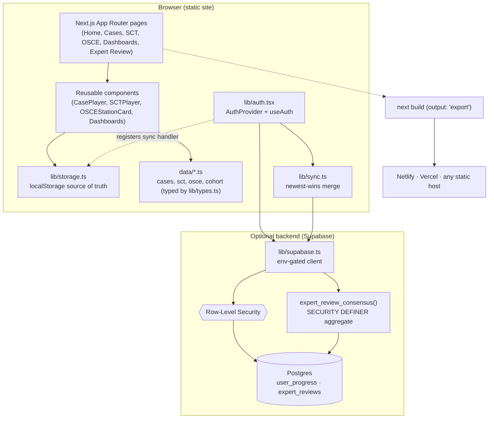

# CaseStep — Architecture

CaseStep is a **static-first** application: it compiles to plain HTML/CSS/JS and
runs entirely in the browser, with an **optional** Supabase backend that layers
on cloud accounts and sync without changing the UI. This document explains the
moving parts and the key design decisions.

## High-level diagram

## Data flow

1. **Content** lives in `data/*.ts` as plain, typed objects (`lib/types.ts` is
   the contract). The UI never talks to a database directly — it reads these
   modules, so content can later be served from a database that returns the same
   shapes.
2. **Learner progress** (case decisions, reflections, SCT/OSCE results) is
   written through `lib/storage.ts`, which persists to `localStorage` and emits
   a `casestep:update` event so `useStore()` re-renders subscribers.
3. **Optional cloud sync**: when Supabase is configured *and* a user is signed
   in, `lib/auth.tsx` registers a sync handler in the storage layer. Every local
   write is then mirrored (debounced) to the `user_progress` table. On sign-in,
   `lib/sync.ts` performs a **newest-wins merge** of local and cloud state so no
   progress is lost across devices.

## Key design decisions

| Decision | Rationale |
| --- | --- |
| **Static export** (`output: 'export'`) | Zero server runtime → cheap, fast, deploy-anywhere; ideal for an academic project that must be easy to host and demo. |
| **localStorage as source of truth** | The app is fully functional offline and with no backend; cloud sync is additive, so components never had to be rewritten to become "async". |
| **Env-gated Supabase client** | `getSupabase()` returns `null` when unconfigured, making the entire auth/sync/consensus layer a no-op by default. One codebase serves both the demo and the research deployment. |
| **RLS + `SECURITY DEFINER` consensus** | Experts cannot read each other's raw reviews, yet the Delphi consensus (aggregates only) is still computable — the function returns medians/IQR/% agreement, never individual rows. |
| **Custom inline SVG icons** | No icon-library dependency; smaller, self-contained bundle. |
| **Typed data contracts** | `lib/types.ts` decouples UI from storage, so a Supabase/Firebase table mirroring the fields is a drop-in replacement (see `FUTURE DB INTEGRATION` comments). |

## Backend schema (when enabled)

Defined in [`supabase/schema.sql`](../supabase/schema.sql):

- `user_progress(user_id, data jsonb, updated_at)` — one progress blob per user,
  RLS-restricted to the owner.
- `expert_reviews(...)` — one row per expert review, RLS-restricted to the
  submitting expert.
- `expert_review_consensus(case_slug)` — `SECURITY DEFINER` function returning
  per-dimension aggregates (n, median, Q1, Q3, % agreement) to authenticated
  users; a reference normalised analytics schema is included as comments.

## Directory map

See the "Project structure" section of the [README](../README.md) for the
annotated file tree.
